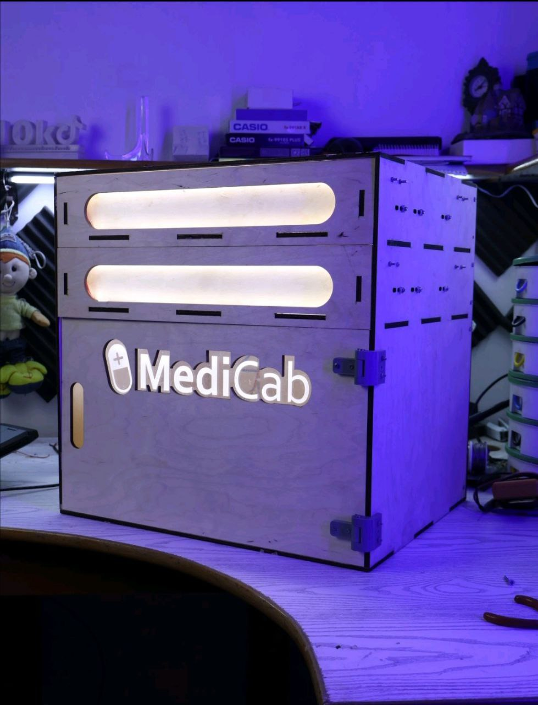
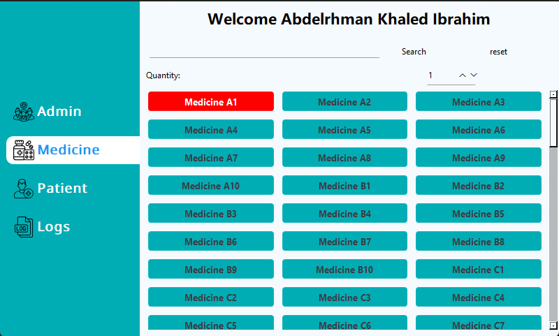

# Medicap: AI-Powered Medicine Dispensing Cabin

## Project Overview
Medicap is a **secure, automated medicine dispensing system** designed for hospitals. It features **two motorized drawers** that operate based on **authorized input**, ensuring only verified personnel—using **Python-based face recognition**—can access medication. The system maintains **detailed logs** tracking **who accessed the cabin, when, and what was dispensed**. With integrated **inventory management, access control, and a responsive touchscreen GUI**, Medicap enhances **security, efficiency, and accountability** in hospital medication distribution.

## Features
- **Automated medicine dispensing** with secure access control.
- **Face recognition authentication** using Python libraries.
- **Inventory tracking** to manage medicine stock efficiently.
- **Logging system** to track dispensing activity.
- **Responsive touchscreen GUI** built with **PySide6** for tablets.
- **Serial communication** between **Arduino Mega (master)** and software.
- **SPI communication** between **Arduino Mega (master)** and **Arduino Nano (slaves)**.
- **LED indicators** for drawer slots containing medicine.

## Hardware Components & Their Functions
The **Medicap** system is built using the following hardware components:

| Component              | Function |
|-----------------------|----------|
| **Electromagnet Lock** | Secures the drawer to prevent unauthorized access. |
| **Arduino Nano** | Acts as a **slave**, controlling individual drawers. |
| **Arduino Mega** | Acts as a **master**, communicating between software and hardware. |
| **Servo Motor** | Controls precise movements of certain mechanisms. |
| **WebCam** | Captures facial images for **face recognition authentication**. |
| **Limit Switch Module** | Sets drawer movement limits, ensuring correct positioning. |
| **Proximity Sensor** | Detects the drawer’s status (**opened or closed**). |
| **12V Power Supply** | Powers the system components. |
| **Step Down Module** | Converts power supply voltage to required levels. |
| **DC Motor** | Provides motion for drawer operation. |
| **Motor Drive** | Controls DC motor power and movement. |
| **MOSFET Module** | Regulates electrical power to motors efficiently. |

## Software Components
### Backend
The backend is responsible for **access control, inventory management, and logging**. It utilizes:
- **SQLite Database** to store information about **inventory, dispensing logs, staff credentials**, and medicine stock levels.
- **Python-Based Face Recognition** to authenticate personnel before granting drawer access.

### Graphical User Interface (GUI)
- Developed using **PySide6** for a **responsive touchscreen interface**.
- Optimized for **small tablets** to provide user-friendly navigation.
- Allows **authorized medical staff** to interact with the system easily.

## Communication & Data Exchange
### Software ↔ Hardware Communication
- **Serial Communication** is used between **Arduino Mega (master)** and the **software**.
- **SPI Communication** is used between **Arduino Mega (master)** and **Arduino Nano (slaves)** in each drawer.
- **LED Indicators** in each slot help visually identify medicine placement.

## Software Setup
### Required Libraries
To run **Medicap**, install the following  requirements:
```bash
pip install -r requirements.txt
```
